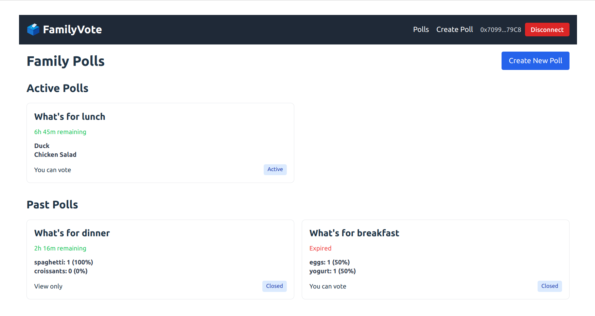

# 🗳️ FamilyVote DApp

A lightweight decentralized voting app for family decisions, built with [Foundry](https://book.getfoundry.sh/), Solidity, and a minimal [React](https://reactjs.org/) frontend.

You can create polls like **"What’s for dinner?"** and allow only specific family members to vote. Results are stored and displayed on-chain.



## ✨ Features

### 🔐 Smart Contract (Solidity)
- Create a poll with:
    - Question
    - Choices (e.g., Pizza, Pasta)
    - Whitelisted voter addresses
    - Voting deadline (in seconds)
- Only allowed voters can vote
- Each voter can vote once per poll
- Anyone can read:
    - Current results
    - Past polls

### 🧪 Tests (Foundry)
- Deploys the `FamilyVote` contract
- Creates a test poll with 2 voters and 2 choices
- Casts a vote and checks the results

### 🖥️ Frontend (React + Viem + Wagmi)
> First version runs against **Avil local node only** for demo/dev

- Connect your wallet (Metamask etc.)
- Create a new poll
- See active and past polls
- Vote on active polls (if you're whitelisted)
- View results and expiration time

---

## 🛠️ Installation

### Prerequisites
- [Foundry](https://book.getfoundry.sh/getting-started/installation)
- [Metamask](https://metamask.io/) or another Ethereum wallet 
- [Node.js](https://nodejs.org/)
- [Npm](https://www.npmjs.com/)

---

### 🔧 Clone & Install

```bash
git clone https://github.com/pragmaxim/famvote.git
cd famvote
```

1. Install dependencies:

```bash
cd frontend
npm install
```

2. Start the development server:

```bash
npm run dev
```

3. Open your browser and navigate to [http://localhost:3000](http://localhost:3000)

### Connecting to Anvil

1. Start Anvil in a separate terminal:

```bash
anvil
```

2. Import one of the Anvil private keys into Metamask:
  - Click on your account icon in Metamask
  - Select "Import Account"
  - Paste one of the private keys from the Anvil output
  - Click "Import"

3. Connect Metamask to the Anvil network:
  - Network Name: Anvil
  - RPC URL: http://127.0.0.1:8545
  - Chain ID: 31337
  - Currency Symbol: ETH

4. Deploy the FamilyVote contract to Anvil:

```bash
# From the project root (not the frontend directory)
# Replace <PRIVATE_KEY> with one of the private keys from the Anvil output
# For example: 0xac0974bec39a17e36ba4a6b4d238ff944bacb478cbed5efcae784d7bf4f2ff80
forge create src/FamilyVote.sol:FamilyVote --private-key <PRIVATE_KEY> --broadcast
```

5. After successful deployment, you'll see output similar to:
```
Deployer: 0xf39Fd6e51aad88F6F4ce6aB8827279cffFb92266
Deployed to: 0x5FbDB2315678afecb367f032d93F642f64180aa3
Transaction hash: 0x...
```

6. Update the CONTRACT_ADDRESS in `frontend/src/hooks/useContract.js` with the deployed contract address:
```javascript
// Change this line
const CONTRACT_ADDRESS = '0x5FbDB2315678afecb367f032d93F642f64180aa3';
```

## Building for Production

```bash
npm run build
```

The build output will be in the `dist` directory.
